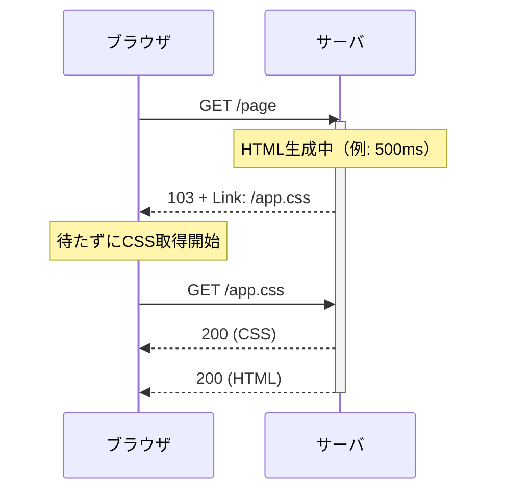

# 103 Early Hints とは

**最終レスポンスの前に、同じ接続で先に送る「予告」。** 本命を作っている間に
クライアントを先回りさせる。

## なぜ必要か

ブラウザは **HTML を受け取るまで、どの CSS/JS が要るかを知らない**（URL は `<head>` の
`<link>` 等に書いてあるため）。サーバが生成している間、ブラウザは何をすべきか分からず
**ただ待つ**。

```text
通常:
サーバ   |===== HTML生成 500ms =====|
ブラウザ                            |解析|= CSS取得 100ms =|描画   合計 600ms

103あり:
サーバ   |===== HTML生成 500ms =====|
ブラウザ |= CSS取得 100ms =|                          |解析|描画   合計 500ms
```

その死んでいる待ち時間に、サブリソースの取得を前倒しする。**効くのはサーバが遅いときだけ**
（TTFB が短いなら無意味）。

## ワイヤ上

1本の接続に**ステータス行が2回**現れる。

```http
GET /page HTTP/1.1
Host: localhost:8080

HTTP/1.1 103 Early Hints          ← 中間レスポンス（即座）
Link: </app.css>; rel=preload; as=style

HTTP/1.1 200 OK                   ← 最終レスポンス（生成完了後）
Content-Type: text/html

<html>...
```



## 要点

- **送るのは URL の予告だけ。** 実体ではなく、取るかはクライアントが決める。
  - 対して HTTP/2 Server Push は実体を送りつけ、キャッシュ済みでも無駄になり廃れた。
- **103 は最終回答ではない。** この後に必ず本命が来る。
- 1xx は中間レスポンス（informational）。他に 100 Continue、101 Switching Protocols。
- HTML の先頭を先に flush する手もあるが、**ステータスとヘッダが確定**してしまい後から
  500 に変えられない。103 は未確定のまま送れる。
- 実用の主戦場は **CDN**（オリジンを待つ間にエッジが 103 を返す）。
